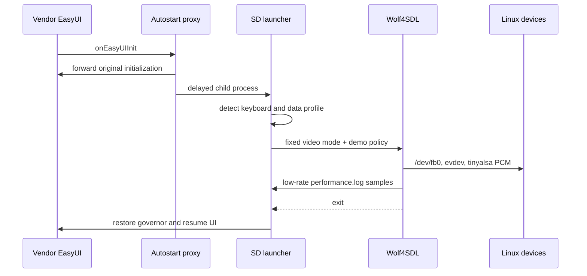

# Architecture

## Product boundary

RetroPort AI has two cooperating layers:

- a deterministic local tool that collects evidence and enforces release rules;
- a repository-local Codex skill that guides GPT-5.6 through evidence review,
  hypothesis formation, human approval, patching, and verification.

The AI layer never substitutes a claim for a measurement. Unknown hardware
metrics remain `null`, and proposed changes are kept separate from observed
facts.

## Components

| Component | Responsibility | Output |
|---|---|---|
| `tools/retroport.py` | Scan, release check, binary benchmark, device-log parsing, comparison | JSON and Markdown evidence |
| `retroport.toml` | Target contract, source roots, rules, deny lists, verification commands | Versioned configuration |
| `.codex/skills/retroport-ai` | GPT-5.6/Codex reasoning protocol | Reviewable plan and bounded patch |
| `scripts/fetch_sources.sh` | Fetch pinned upstreams and apply patches | Reconstructed private build tree |
| `scripts/verify_patches.sh` | Reapply and semantically compare patch stacks | Reproducibility result |
| `scripts/build_z6s.sh` | Cross-build both data profiles and check the ABI | ARM binaries in ignored `dist/` |
| `scripts/test_qemu.sh` | Exercise parser, data loading, and no-keyboard demo startup | 20-second smoke-test result |
| `patches/` | Preserve reviewable platform adaptations | Four upstream patch layers |

## Z6S runtime path

The proxy is loaded inside a vendor musl process and therefore uses `-nostdlib`,
direct ARM syscalls, and only `dlopen`/`dlsym`. The game is a standalone static
glibc ARM EABI5 soft-float executable. These are intentionally separate ABI
domains.

## Portability seams

Wolf4SDL was selected instead of directly porting the DOS source because it
already replaces x86 assembly, VGA, interrupts, and Sound Blaster access. The
device-specific surface is limited to four seams:

1. video: a fixed native scanout and a software logical-to-native presenter;
2. input: capability-based evdev discovery, keyboard hot-plug, and touch;
3. audio: a minimal threadless mixer and tinyalsa PCM pump;
4. boot: an SD-contained, reversible proxy and launcher.

The engine renders at 320x200. Every visible state, including the logo, menu,
fades, demos, and gameplay, reaches the same opaque 480x272x32 presentation
path. This prevents mode changes and the zero-alpha black-screen failure seen
in the first device test.

## Data and trust boundaries

`third_party/`, `dist/`, commercial game data, the vendor UI, firmware binaries,
device logs, and SD deployment payloads are local inputs, not public source.
The public repository stores pins, patches, authored adapters, scripts, tests,
and measured metadata. `.gitignore` is defense in depth; the release guard
checks the actual Git index before publication.

## Dependency pins

| Dependency | Commit | Role |
|---|---|---|
| Wolf4SDL | `3d41ccce8f8fecbed83aa9d8d42734c2c7e62374` | Built engine |
| id Software wolf3d | `05167784ef009d0d0daefe8d012b027f39dc8541` | Historical reference |
| SDL 1.2 | `457d4e55ffe1b6ad4c4fa4559dbda8360bf8253d` | Linux framebuffer substrate |
| tinyalsa | `e43025bbf702eb7dd8edd48c1eb50530c60f1de8` | Minimal PCM access |

## Decision records

- A full RetroPie-style image was rejected because the target budget and
  undocumented firmware favor one bounded, reversible port.
- Hosted inference is not required for the MVP. Codex is the interactive AI
  surface; deterministic evidence remains runnable offline.
- Device auto-patching is rejected. The workflow generates proposals, waits for
  human approval, and relies on standard tests.
- The upstream checkouts are fetched, not vendored, to preserve license clarity
  and keep the public history reviewable.
