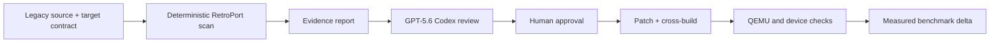

# RetroPort AI

**Human-led, evidence-first AI-assisted modernization for constrained legacy
hardware.**

Created and led by [@iz2rpn](https://github.com/iz2rpn). The author defined the
product, recovered and tested the hardware, supplied lawful local inputs, and
made the final engineering decisions. Codex and GPT-5.6 served as technical
collaborators for analysis, alternatives, automation, and documentation.

RetroPort AI grew from hands-on recovery work by the device owner: preserving
the SD, choosing a focused Wolf3D product instead of a general emulator image,
supplying legally owned data, testing builds on the LCD, and deciding which
trade-offs to accept. Codex and GPT-5.6 are engineering allies in that process,
not autonomous authors. Together, the workflow turns an undocumented legacy
port into a reproducible engineering case study. Its first target is Wolf4SDL
on the NOVA3D Z6S: ARMv5TE,
soft-float, Linux 3.10, a 480x272 framebuffer, evdev input, and tinyalsa audio.
The repository combines deterministic analysis with a GPT-5.6-ready Codex
workflow so an engineer can distinguish measured facts from proposals before
changing code.

> This public repository contains no Wolfenstein 3D game data, ROMs, commercial
> assets, vendor firmware, recovered binaries, or proprietary UI resources.
> Supply legally obtained data locally; the release guard prevents known private
> paths and artifacts from being committed.

## Physical hardware demo

[](https://www.youtube.com/shorts/TgmA7cbyw-s)

[Watch the YouTube Short](https://www.youtube.com/shorts/TgmA7cbyw-s) showing
Wolf3D running on the physical LCD. This is real-device evidence, not an emulator
capture. The submission video will add the RetroPort AI/Codex workflow and
instrumented measurements around this working result.

## Why it exists

Legacy porting usually starts with incomplete evidence: unknown ABI details,
old build systems, hardware-specific patches, and performance claims that are
hard to reproduce. RetroPort AI provides a small, inspectable workflow:

1. `tools/retroport.py` scans source and configuration deterministically.
2. It produces line-level evidence, dependency pins, patch statistics, binary
   facts, and release-safety results.
3. The repository-local `retroport-ai` Codex skill asks GPT-5.6 to reason over
   that evidence, label assumptions, propose a bounded patch, and define tests.
4. A human approves the change; normal scripts build and verify it.
5. Device telemetry is parsed into comparable startup, presentation-rate, and
   memory measurements without inventing unavailable results.



## Wolf3D/Z6S case study

The case study demonstrates a complete vertical slice:

- reproducible upstream commit pins and four reviewable patch layers;
- ARMv5TE EABI5 soft-float static builds for WL1 and WL6 data profiles;
- one fixed 480x272x32 physical video mode from logo through menu and gameplay;
- a 320x200 logical renderer with an opaque full-screen scaler;
- keyboard hot-plug plus an optional direct-touch control grid;
- keyboard-free startup that shows the logo and menu, then enters demo mode;
- a threadless eight-channel mixer with controlled ALSA recovery;
- low-overhead device metrics emitted once per five-second window;
- QEMU smoke tests and a tracked legal-release gate.

The original id Software DOS source is reference material; Wolf4SDL is the
portable engine actually built. Neither upstream source tree is vendored in the
public history. `scripts/fetch_sources.sh` checks out exact upstream commits and
applies the tracked patches.

## Quick start

Requirements: Linux or WSL, Python 3.11+, Git, patch, make, and the
`arm-linux-gnueabi` cross-toolchain. QEMU user mode is recommended.

```bash
bash scripts/fetch_sources.sh
python3 tools/retroport.py analyze --json reports/wolf3d-evidence.json
bash scripts/verify_patches.sh
bash scripts/build_z6s.sh wl1
bash scripts/build_z6s.sh wl6
bash scripts/test_qemu.sh
python3 -m unittest -v
python3 tools/retroport.py check-release
```

Commercial WL6 data is never downloaded. A local build may use data from a
lawfully owned copy; WL1 also requires the user to supply a compatible data set.
See [BUILDING.md](BUILDING.md) and
[SD installation](docs/08_SD_INSTALLATION.md).

## Run the AI-assisted workflow

Open this repository in Codex, select GPT-5.6, and invoke the repository-local
`retroport-ai` skill with a bounded question, for example:

```text
Use $retroport-ai to analyze the Z6S video path. Keep facts, inferences, and
proposals separate. Do not edit until I approve the proposed patch and tests.
```

The skill is deliberately evidence-first. The developer remains responsible for
the product direction, approval, implementation judgment, licensing, and
physical test. The AI does not replace the compiler, release guard, QEMU, or
hardware validation. See
[AI_DEVELOPMENT_LOG.md](AI_DEVELOPMENT_LOG.md) for accepted, rejected, and
deferred suggestions.

## Current evidence

Both instrumented profiles cross-build and survive the repeatable 20-second
QEMU no-keyboard smoke test. The post-telemetry files are 1,000,384 bytes (WL1)
and 1,000,632 bytes (WL6). The project author confirmed correct, smooth operation
on the physical LCD and published the hardware demo above. Physical FPS,
resident memory, touch latency, audio, and USB-host behavior remain separate
quantitative checks until a new device run supplies `performance.log`.

See [BENCHMARKS.md](BENCHMARKS.md) for definitions and limitations. No number in
this repository is presented as a physical-device result unless its capture
method and source log are available.

## Documentation

- [Project plan and MVP](PROJECT_PLAN.md)
- [Architecture](ARCHITECTURE.md)
- [Build and verification](BUILDING.md)
- [Benchmarks](BENCHMARKS.md)
- [AI development log](AI_DEVELOPMENT_LOG.md)
- [Roadmap](ROADMAP.md)
- [Contributing](CONTRIBUTING.md)
- [Devpost submission draft](DEVPOST_SUBMISSION.md)
- [Three-minute demo script](DEMO_SCRIPT.md)
- [Glossary](GLOSSARY.md)
- [Target-specific engineering notes](docs/01_HARDWARE_EVIDENCE.md)

## Limits

- The corrected full-screen build still needs a fresh physical-panel capture.
- ADB proves USB device/gadget mode, not keyboard host/OTG capability.
- Speaker impedance and amplifier limits are not documented by recovered
  evidence; follow the hardware safety notes before connecting a speaker.
- QEMU validates executable startup and data loading, not the vendor
  framebuffer, Goodix touch, ALSA hardware, or scanout timing.
- GPT-5.6 suggestions require human review and conventional verification.

## License and legal boundary

Project-authored code and patches are offered under GPL-2.0-only; individual
upstreams retain their own licenses. Wolfenstein 3D names and game assets remain
the property of their respective owners and are not included. Read
[THIRD_PARTY_NOTICES.md](THIRD_PARTY_NOTICES.md) before distributing a build.

## OpenAI Build Week

RetroPort AI targets the **Developer Tools** track. It is a human engineering
project strengthened by AI-assisted analysis and review. Submission materials
are kept in the repository so claims can be audited. Before submission, the author
must add a public device demo, verify the primary Codex session used GPT-5.6,
and record the session feedback ID required by the event rules.
